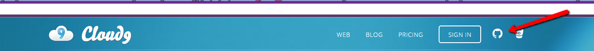
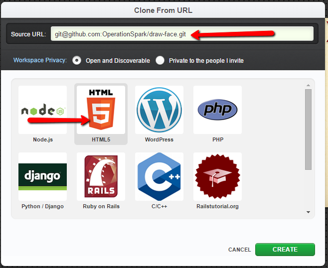
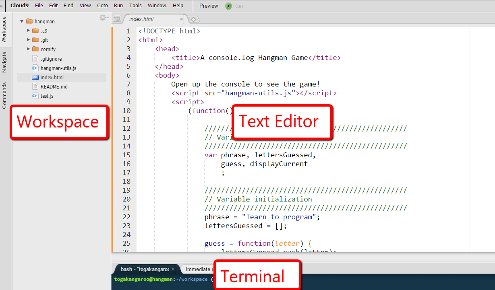
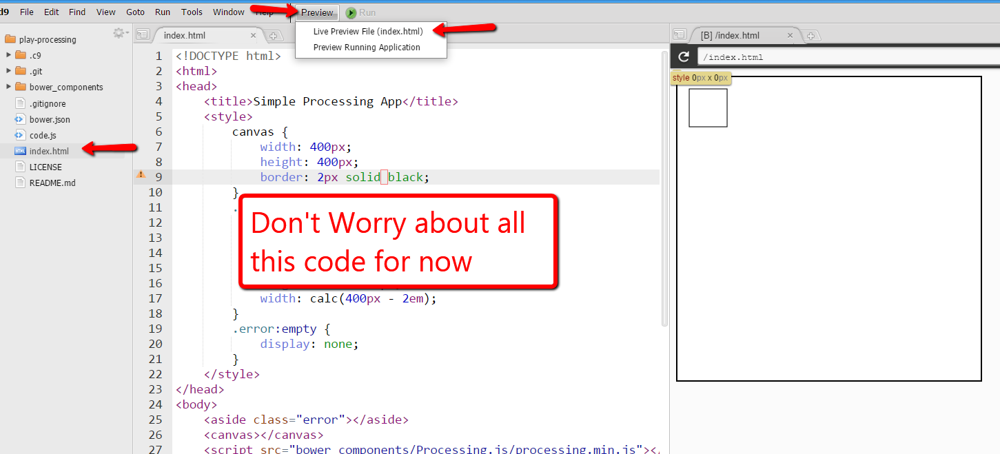
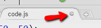
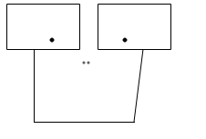
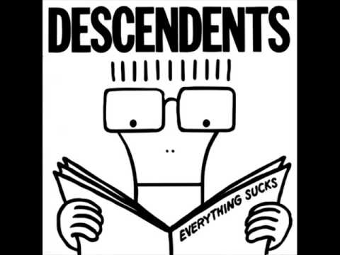
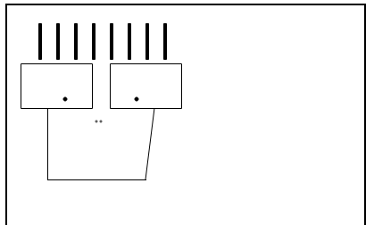

Practice coding by drawing a face in a Khan-Academy style ProcessingJs environment

<a rel="license" href="http://creativecommons.org/licenses/by-nc-sa/4.0/"></a><br />This work is licensed under a <a rel="license" href="http://creativecommons.org/licenses/by-nc-sa/4.0/">Creative Commons Attribution-NonCommercial-ShareAlike 4.0 International License</a>.

# Set Up Programming Environment in Cloud 9

* Go to [http://c9.io](http://c9.io) and sign in with Github.

* Let's get the project template that we set up for you. On the left click **Create New Workspace** and select **Clone From Url**
* For a source url paste in `git@github.com:OperationSpark/draw-face.git`. Select **Html 5** as type and click **Create**

* You will now see the project being processed on the left. Once it is done (usually takes 10-20 seconds) click on it and click the green **Start Editing** in the center. This will open up the project!


You will now see the Cloud 9 programming environment. The most important areas to note are the *workspace file manager* on the left and the *text editor* in the center. You will use the *workspace* to open files and the *text editor* to type code. You will also see the *terminal* area toward the bottom. We will use this in later classes. For now you can close it to give yourself more room.



[An article with more information is here](https://github.com/OperationSpark/javascript-wiki/wiki/Cloud9).

# Run the template

In the workspace on the left you see a list of files and folders.

* **Double-click** *index.html* in the *workspace*. This will open up this file in the *text editor*. There is lots of code. Don't worry about it for now.

* At the top, click **Preview** and then **Live Preview File** to start the web page. You will see your web page start running in a split window.
    * If the *Live Preview* selection is greyed out, make sure you **double-clicked** the `index.html` file.



* Now in your workspace **double-click** `code.js` to open the code file. *This is where you will be working today*.
    * You can now close the *workspace* to give yourself more room by clicking on **Workspace** on the right.
* In `code.js` there is code for drawing a rectangle. You know how this works! Try **changing the numbers**. It didn't update the picture, right? That's because we didn't save the file. You can always *save the current file* by pressing <kbd>ctrl</kbd>+<kbd>s</kbd>. You will want to do this a lot. When a file has unsaved changes it will have a grey circle on the file name tab. 

# Draw a Face

Both here and in your Khan Academy homework this week you will be working with something called *Processing.js*. Normally javascript isn't about drawing circles and lines, *Processing.js* however adds in that ability.

Here are some commands you learned about in homework

* [`rect(x, y, width, height);`](http://processingjs.org/reference/rect_/). Draws a rectangle
* [`ellipse(centerX, centerY, width, height);`](http://processingjs.org/reference/ellipse_/). Draws an ellipse
* [`line(startX, startY, endX, endY);`](http://processingjs.org/reference/line_/). Draws a line

You can also use
* [`fill(red, green, blue);`](http://processingjs.org/reference/fill_/). To fill your shapes with color. Where red, green, and blue are each numbers between 0 and 255.

**Pair up with someone and work together**

Using these commands, **draw a face** that looks like this.



Make sure you and your partner have done this before moving on. Then scroll down for Part 2.

-----------------------------------------------------------

<br/>
<br/>
<br/>
<br/>
<br/>
<br/>
<br/>
<br/>
<br/>
<br/>
<br/>
<br/>
<br/>
<br/>
<br/>
<br/>
<br/>
<br/>
<br/>
<br/>
<br/>
<br/>
<br/>
<br/>
<br/>
<br/>
<br/>
<br/>
<br/>
<br/>
<br/>
<br/>
<br/>

-----------------------------------------------------------

# Draw Hair

There's an old punk rock band called the descendants. This is looking surprisingly close to their logo, Milo:



**Change your code** to give our Milo some hair.



Note that you probably had to do a bunch of math to move the face downward. What a pain! And if we want longer hair or a hat we have to do that again!

Can we have just one number that determines how close to the top we start drawing and have everything move down from there?

Let's say we drew our two eyes like this

```js
rect(15, 65, 80, 50);
rect(115, 65, 80, 50);
fill(0, 0, 0);
ellipse(65, 105, 4, 4);
ellipse(145, 105, 4, 4);
```

If we wanted to move everything down by 20 pixels we would add that to change `65` to `85`, and `105` to `125`. Adding is annoying and people aren't great at math. But computers are!

**Change your code to**

```js
var top = 0;
rect(15, top + 65, 80, 50);
rect(115, top + 65, 80, 50);
fill(0, 0, 0);
ellipse(65, top + 105, 4, 4);
ellipse(145, top + 105, 4, 4);
```

Now **try changing** `var top = 0;` to `var top = 30;`. The eyes will move all at once!

So one use of variables is so *we can change one labeled part to change lots of things at once*.
<br/>
<br/>
<br/>
<br/>
<br/>
<br/>
<br/>
<br/>
<br/>
<br/>
<br/>
<br/>
<br/>
<br/>
